# 项目多级索引系统 (Project Multi-level Index)

<div align="center">

> 受《哥德尔、埃舍尔、巴赫》启发的分形自指文档系统
>
> 让代码项目如赋格曲般自我指涉、自我维护、优雅和谐

[](https://github.com/Claudate/project-multilevel-index/releases)
[](docs/development/I18N_GUIDE.md)
[](LICENSE)
[](https://claude.ai/code)
[](docs/development/CONTRIBUTING.md)

**🌐 多平台代码文档自动化系统**

CLI工具 + Claude Code插件 + VSCode扩展(开发中)

[简体中文](#) | [English](README_EN.md) | [📖 文档导航](#-文档导航)

</div>

---

## 📖 核心理念

**三级分形文档系统** - 自动维护项目的索引和依赖关系：

```
PROJECT_INDEX.md (根索引)
  ├─ 项目概览、架构说明
  ├─ 目录结构导航
  └─ Mermaid 依赖关系图

每个文件夹/
  └─ FOLDER_INDEX.md (文件夹索引)
       ├─ 架构说明
       ├─ 文件清单
       └─ "本文件夹变化时，更新我"

每个文件
  └─ 文件头注释
       ├─ Input: 依赖什么
       ├─ Output: 提供什么
       ├─ Pos: 在系统中的定位
       └─ "我被更新时，更新我的注释和索引"
```

### 三大特性

- **🔄 自相似性**：每个层级都有相同的索引结构
- **🪞 自指性**：每个文档都声明"当我变化时，更新我"
- **🎼 复调性**：代码与文档相互呼应，局部影响整体

---

## 🚀 快速开始

### 方法 1: CLI 工具 `codex`（推荐用于 CI/CD）

**独立命令行工具** - 不依赖任何编辑器：

```bash
# 1. 克隆并安装
git clone https://github.com/Claudate/project-multilevel-index.git
cd project-multilevel-index/cli
npm install && npm run build && npm link

# 2. 使用
cd /your/project
codex init
```

**输出示例**:
```
🎼 Fractal Multi-level Index System
✔ Found 45 code files
✔ Generated 45 file headers
✔ Generated 8 folder indexes
✔ Generated PROJECT_INDEX.md
✅ Index system initialized successfully!
```

📖 [CLI完整文档](cli/README.md) | [实现说明](docs/development/CLI_IMPLEMENTATION.md)

---

### 方法 2: Claude Code 插件（推荐用于 Claude Code）

**最简单的安装方式**：

```bash
/plugin marketplace add Claudate/project-multilevel-index
/plugin install project-multilevel-index
```

**使用**：

```bash
# 初始化索引
/project-multilevel-index:init-index

# 自动更新（Hook 自动触发，无需手动）
# 修改代码文件后会自动更新索引
```

📖 [安装指南](docs/user-guide/INSTALL_GUIDE.md) | [快速上手](docs/user-guide/QUICKSTART.md)

---

### 方法 3: VSCode 扩展（开发中）

**完全自动化方案** - 预计 2026-01-10 发布

支持平台：
- ✅ VSCode
- ✅ Cursor
- ✅ Windsurf
- ✅ Kiro

📖 [技术方案](docs/development/VSCODE_EXTENSION_PLAN.md) | [开发进度](docs/development/IMPLEMENTATION_ROADMAP.md)

---

## ⭐ 核心功能

### 🤖 自动化索引

- ✅ **自动扫描**: 递归扫描项目中的所有代码文件
- ✅ **智能分析**: 使用 AST 或正则分析依赖关系
- ✅ **自动生成**: 文件头注释 + 文件夹索引 + 项目索引
- ✅ **自动更新**: 文件修改时自动更新相关索引（Claude Code）

### 🌍 10+ 编程语言

JavaScript/TypeScript • Python • Java/Kotlin • Rust • Go
C/C++ • PHP • Ruby • Swift • C#

📖 [文件头示例](FILE_HEADERS.md)

### 📊 可视化依赖

```mermaid
graph TB
    Controllers -->|调用| Services
    Services -->|使用| Models
    Services -->|使用| Utils
```



自动生成 Mermaid 依赖关系图，支持：
- GitHub
- VSCode (Mermaid 扩展)
- Obsidian
- 任何 Markdown 查看器

---

## 📚 命令速查

| 命令 | 功能 |
|------|------|
| [`init-index`](COMMANDS.md#1-init-index---初始化索引系统) | 初始化索引系统 |
| [`update-index`](COMMANDS.md#2-update-index---更新索引) | 手动更新索引 |
| [`check-index`](COMMANDS.md#3-check-index---一致性检查) | 一致性检查 |
| [`set-language`](COMMANDS.md#4-set-language---切换语言) | 切换语言 |

> **💡 提示**: Claude Code 命令需要前缀 `/project-multilevel-index:`

📖 [命令详细说明](COMMANDS.md)

---

## 🎯 适用场景

查看 **[USE_CASES.md](USE_CASES.md)** 了解 8 个真实应用场景：

1. **开源项目文档维护** - 降低贡献门槛
2. **企业级微服务项目** - 架构可视化
3. **个人学习项目** - 记录成长过程
4. **技术债务重构** - 追踪重构进度
5. **API 设计评审** - 端点清单一目了然
6. **多团队协作** - 避免重复开发
7. **代码审查辅助** - 快速理解变更影响
8. **技术文档生成** - 自动生成 API 文档

---

## 🗺️ 平台支持

| 平台 | 自动化程度 | 状态 | 文档 |
|------|-----------|------|------|
| **CLI 工具** | 手动命令 | ✅ 已发布 | [CLI README](cli/README.md) |
| **Claude Code** | 完全自动 | ✅ 已发布 | [安装指南](docs/user-guide/INSTALL_GUIDE.md) |
| **VSCode Extension** | 完全自动 | 🚧 开发中 | [技术方案](docs/development/VSCODE_EXTENSION_PLAN.md) |
| **规则文件方案** | 半自动 | ✅ 可用 | [Cursor](examples/cursor-example/) \| [Windsurf](examples/windsurf-example/) \| [Kiro](examples/kiro-example/) |

📖 [平台详细对比](docs/user-guide/PLATFORM_SUPPORT.md)

---

## 📖 文档导航

📚 **[完整文档索引](docs/README.md)** - 查看所有分类文档

### 快速开始
- [安装指南](docs/user-guide/INSTALL_GUIDE.md) - 详细的安装步骤
- [快速上手](docs/user-guide/QUICKSTART.md) - 5分钟快速上手
- [使用示例](docs/user-guide/EXAMPLES.md) - 完整的使用示例

### 核心文档
- [命令参考](docs/user-guide/COMMANDS.md) - 所有命令的详细说明
- [平台支持](docs/user-guide/PLATFORM_SUPPORT.md) - 各平台对比和选择建议
- [文件头示例](docs/user-guide/FILE_HEADERS.md) - 10+ 种语言的文件头模板

### 高级主题
- [国际化指南](docs/development/I18N_GUIDE.md) - 语言切换和配置
- [使用案例](docs/user-guide/USE_CASES.md) - 8 个真实应用场景
- [演示脚本](docs/planning/DEMO_SCRIPT.md) - 完整的演示录制指南

### 开发者
- [贡献指南](docs/development/CONTRIBUTING.md) - 如何参与贡献
- [CLI 实现说明](docs/development/CLI_IMPLEMENTATION.md) - CLI 工具技术细节
- [VSCode 扩展计划](docs/development/VSCODE_EXTENSION_PLAN.md) - VSCode 扩展技术方案
- [开发路线图](docs/development/IMPLEMENTATION_ROADMAP.md) - 整体开发进度

---

## 📝 文件头注释示例

### TypeScript
```typescript
/**
 * Input: express, bcrypt, ./models/User
 * Output: router, POST /login, POST /register
 * Pos: API层-认证路由，处理用户登录注册
 *
 * 本注释在文件修改时自动更新
 */
```

### Python
```python
"""
Input: flask, sqlalchemy, .models.User
Output: UserController 类, /api/users 路由
Pos: API层-用户控制器，处理用户HTTP请求

本注释在文件修改时自动更新
"""
```

📖 [查看所有语言示例](docs/user-guide/FILE_HEADERS.md)

---

## 🎬 完整示例项目

我们提供了三个平台的完整示例项目，包含实际代码和配置：

- **[Cursor 示例](examples/cursor-example/)** - 完整的 TypeScript 项目
- **[Windsurf 示例](examples/windsurf-example/)** - Windsurf 配置
- **[Kiro 示例](examples/kiro-example/)** - Kiro 配置

每个示例包含：
- ✅ 完整项目结构（Controllers/Services/Models/Utils）
- ✅ 配置好的规则文件
- ✅ 已生成的索引文件
- ✅ 详细使用说明

---

## 💬 社区与支持

### 微信交流群

扫描二维码加入微信群，与其他用户交流使用经验：

<div align="center">


</div>

📖 [更多社区资源](COMMUNITY.md)

### GitHub

- 📋 [Issues](https://github.com/Claudate/project-multilevel-index/issues) - 报告问题
- 💬 [Discussions](https://github.com/Claudate/project-multilevel-index/discussions) - 讨论交流
- 🤝 [Contributing](CONTRIBUTING.md) - 贡献指南

---

## 🎓 灵感来源

受道格拉斯·霍夫施塔特《哥德尔、埃舍尔、巴赫：集异璧之大成》启发：

- **自指性**: 文档指向自己，声明"更新我"
- **递归性**: 索引的索引的索引...
- **怪圈**: 代码→文档→代码的无限循环
- **分形**: 每个层级都是整体的缩影

**让代码项目如赋格曲般，自我指涉、自我维护、优雅和谐。** 🎼

---

## 📜 许可证

MIT License - 自由使用、修改和分发

---

<div align="center">

**开始使用 `/project-multilevel-index:init-index`，体验分形文档系统的魅力！** 🚀

[⬆️ 返回顶部](#项目多级索引系统-project-multi-level-index)

</div>
