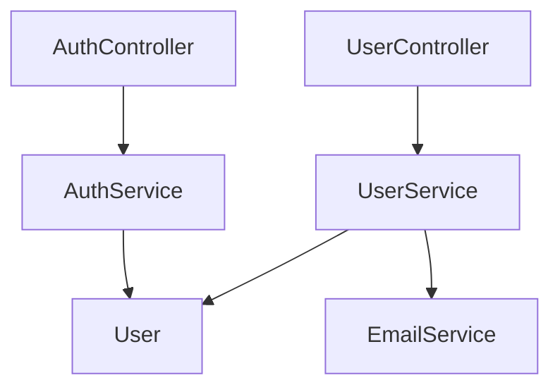

# Project Multilevel Index - 用户使用指南

**版本**: 0.1.0
**更新日期**: 2025-12-25

🎼 分形自指文档系统 - 让代码如赋格曲般自我维护

---

## 📖 目录

1. [快速开始](#快速开始)
2. [安装方法](#安装方法)
3. [核心功能](#核心功能)
4. [命令使用](#命令使用)
5. [配置选项](#配置选项)
6. [常见问题](#常见问题)
7. [使用技巧](#使用技巧)

---

## 🚀 快速开始

### 3分钟上手

1. **安装扩展**
   ```bash
   code --install-extension project-multilevel-index-0.1.0.vsix
   ```

2. **打开项目**
   - 在VSCode中打开你的代码项目
   - 可以是任何包含代码文件的文件夹

3. **初始化索引**
   - 按 `Ctrl+Shift+P` (Mac: `Cmd+Shift+P`)
   - 输入: `Project Index: Initialize`
   - 选择: `Project Index: Initialize Index System`
   - 等待完成（几秒钟）

4. **查看结果**
   - 项目根目录: `PROJECT_INDEX.md`
   - 每个文件夹: `FOLDER_INDEX.md`
   - 每个代码文件: 顶部自动添加了注释

5. **自动更新**
   - 编辑任何代码文件
   - 保存文件 (`Ctrl+S`)
   - 索引自动更新！✨

---

## 💾 安装方法

### 方法1: 从.vsix文件安装（当前）

```bash
# 使用命令行
code --install-extension project-multilevel-index-0.1.0.vsix

# 或在VSCode中:
# 1. 打开扩展面板 (Ctrl+Shift+X)
# 2. 点击 "..." 菜单
# 3. 选择 "从VSIX安装..."
# 4. 选择 project-multilevel-index-0.1.0.vsix
```

### 方法2: 从Marketplace安装（即将上线）

```bash
# 搜索并安装
ext install Claudate.project-multilevel-index
```

### 方法3: 在Cursor中安装

```bash
# Cursor完全兼容VSCode扩展
cursor --install-extension project-multilevel-index-0.1.0.vsix
```

### 验证安装

安装后重启VSCode，然后：
1. 打开扩展面板 (Ctrl+Shift+X)
2. 搜索 "Project Multilevel Index"
3. 应该看到已安装的扩展

---

## ⭐ 核心功能

### 1. 自动生成文件头注释

**效果展示**:

**TypeScript/JavaScript**:
```typescript
/**
 * Input: express, ./models/User, ./services/AuthService
 * Output: UserController, createUser, getUserById, updateUser
 * Pos: API层 - 用户控制器，处理HTTP请求
 *
 * 🔄 Self-reference: When this file changes, update this header
 */

import express from 'express';
import { User } from './models/User';
// ... 你的代码
```

**Python**:
```python
"""
Input: os, sys, typing, .models.user
Output: UserService, create_user, get_user_by_id
Pos: Service层 - 用户业务逻辑

🔄 Self-reference: When this file changes, update this header
"""

import os
import sys
# ... 你的代码
```

**支持的语言**:
- TypeScript / JavaScript
- Python
- Java / Kotlin
- Rust
- Go
- C / C++
- PHP
- Ruby
- Swift
- C#

### 2. 自动生成文件夹索引

**FOLDER_INDEX.md 示例**:
```markdown
## 📁 services/

**Architecture**:
- 业务逻辑层
- 调用数据层和外部API
- 被控制器层调用

**Files**:
- `user.service.ts` - 用户服务：创建、查询、更新用户
- `auth.service.ts` - 认证服务：登录、注册、JWT生成
- `email.service.ts` - 邮件服务：发送验证邮件

🔄 Self-reference: 当此文件夹变化时，更新此索引
```

### 3. 自动生成项目索引

**PROJECT_INDEX.md 示例**:
```markdown
# MyProject - Project Index

**Generated**: 2025-12-25

## 📊 Statistics

- Total files: 45
- Total folders: 8
- Languages: TypeScript, Python, JavaScript

## 📁 Directory Structure

```
src/
├── controllers/ (3 files)
├── services/ (3 files)
├── models/ (2 files)
└── utils/ (5 files)
```

## 🔗 Dependency Graph



🔄 Self-reference: 当项目结构变化时，自动更新此索引
```

### 4. 实时自动更新

- ✅ 监控所有代码文件变化
- ✅ 保存时自动更新文件头
- ✅ 自动更新FOLDER_INDEX.md
- ✅ 防抖处理（避免频繁更新）
- ✅ 后台运行，不影响工作

---

## 🎮 命令使用

### 命令1: Initialize Index System

**作用**: 初始化整个项目的索引系统

**使用场景**:
- 首次使用扩展
- 项目结构大改后重新生成
- 索引文件丢失后重建

**使用方法**:
```
Ctrl+Shift+P → 输入 "init" → 选择 "Project Index: Initialize Index System"
```

**效果**:
- ✅ 扫描所有代码文件
- ✅ 为每个文件添加头注释
- ✅ 为每个文件夹创建 FOLDER_INDEX.md
- ✅ 创建项目根目录的 PROJECT_INDEX.md
- ✅ 生成依赖关系图

**预期时间**:
- 小项目(10-50文件): 1-3秒
- 中项目(50-200文件): 3-10秒
- 大项目(200+文件): 10-30秒

---

### 命令2: Update All Indexes

**作用**: 手动更新所有索引文件（不更新文件头）

**使用场景**:
- 关闭了自动更新功能
- 想立即更新所有索引
- 索引内容不准确时刷新

**使用方法**:
```
Ctrl+Shift+P → 输入 "update" → 选择 "Project Index: Update All Indexes"
```

**效果**:
- ✅ 更新所有 FOLDER_INDEX.md
- ✅ 更新 PROJECT_INDEX.md
- ✅ 重新生成依赖关系图

---

### 命令3: Check Index Consistency

**作用**: 检查索引系统的完整性和一致性

**使用场景**:
- 怀疑索引不完整
- 团队协作后验证
- 定期健康检查

**使用方法**:
```
Ctrl+Shift+P → 输入 "check" → 选择 "Project Index: Check Index Consistency"
```

**检查内容**:
- ✅ PROJECT_INDEX.md 是否存在
- ✅ 每个文件夹是否有 FOLDER_INDEX.md
- ✅ 每个代码文件是否有头注释

**结果**:
- 全部正常: 显示 "✅ Index system is consistent!"
- 有问题: 显示问题列表和修复建议

---

### 命令4: Toggle Auto Update

**作用**: 开启/关闭自动更新功能

**使用场景**:
- 临时关闭自动更新（大量编辑时）
- 需要手动控制更新时机

**使用方法**:
```
Ctrl+Shift+P → 输入 "toggle" → 选择 "Project Index: Toggle Auto Update"
```

**状态**:
- 开启: 保存文件时自动更新
- 关闭: 需要手动运行命令更新

---

## ⚙️ 配置选项

### 打开配置

**方法1**: 命令面板
```
Ctrl+Shift+P → 输入 "settings" → 选择 "Preferences: Open Settings (UI)"
→ 搜索 "Project Multilevel Index"
```

**方法2**: settings.json
```
Ctrl+Shift+P → 输入 "settings" → 选择 "Preferences: Open Settings (JSON)"
```

### 配置项详解

#### 1. 自动更新开关
```json
{
  "projectMultilevelIndex.autoUpdate": true
}
```
- `true`: 保存文件时自动更新（推荐）
- `false`: 需要手动运行命令更新

#### 2. 排除模式
```json
{
  "projectMultilevelIndex.exclude.patterns": [
    "**/node_modules/**",
    "**/.git/**",
    "**/dist/**",
    "**/build/**",
    "**/.next/**",
    "**/target/**"
  ]
}
```
**说明**: 哪些文件夹会被忽略

**建议**: 添加你项目特定的构建目录

#### 3. 使用.gitignore
```json
{
  "projectMultilevelIndex.exclude.useGitignore": true
}
```
- `true`: 自动读取.gitignore规则（推荐）
- `false`: 仅使用exclude.patterns

#### 4. 扫描深度
```json
{
  "projectMultilevelIndex.index.maxDepth": 5
}
```
**说明**: 最多扫描几层文件夹

**建议**:
- 普通项目: 5层够用
- 深层嵌套项目: 增加到8-10

#### 5. 依赖图节点上限
```json
{
  "projectMultilevelIndex.visualization.maxNodes": 50
}
```
**说明**: 依赖关系图最多显示多少个节点

**建议**:
- 小项目: 30-50
- 大项目: 20-30（避免太复杂）

#### 6. 通知开关
```json
{
  "projectMultilevelIndex.notifications.enabled": true,
  "projectMultilevelIndex.notifications.showOnMinorChange": false
}
```
- `enabled`: 是否显示更新通知
- `showOnMinorChange`: 是否显示小更新通知

---

## ❓ 常见问题

### Q1: 扩展激活失败？

**症状**: 打开VSCode后没有看到扩展相关提示

**解决**:
1. 检查扩展是否启用: Extensions → 搜索 "Project Multilevel Index" → 确保已启用
2. 重启VSCode: `Ctrl+Shift+P` → "Reload Window"
3. 查看输出日志: View → Output → 选择 "ProjectIndex"

---

### Q2: 找不到命令？

**症状**: 命令面板搜索不到相关命令

**解决**:
1. 确认已打开工作区（文件夹）
2. 检查扩展是否正确安装
3. 尝试重启VSCode

---

### Q3: 自动更新不工作？

**症状**: 保存文件后索引没有更新

**解决**:
1. 检查自动更新是否开启:
   - Settings → 搜索 "projectMultilevelIndex.autoUpdate"
   - 确保设置为 `true`
2. 检查文件是否在排除列表中
3. 查看Output日志是否有错误

---

### Q4: 文件头注释格式不对？

**症状**: 生成的注释不是预期的格式

**解决**:
1. 检查文件扩展名是否正确
2. 确认语言是否在支持列表中
3. 手动运行 "Initialize Index System" 重新生成

---

### Q5: 性能问题？项目很大时很慢

**症状**: 初始化或更新时卡顿

**优化方案**:
1. 增加排除模式（排除更多目录）
2. 减少依赖图节点上限
3. 临时关闭自动更新
4. 分批处理大项目

---

### Q6: 团队协作时索引冲突？

**症状**: 多人修改代码后索引不一致

**解决**:
1. 将索引文件加入版本控制（推荐）
2. 或将索引文件加入.gitignore
3. 每个人本地运行 "Initialize Index System"

---

## 💡 使用技巧

### 技巧1: 项目文档自动化

```bash
# 1. 初始化索引
运行: Initialize Index System

# 2. 将索引文件加入Git
git add PROJECT_INDEX.md
git add **/FOLDER_INDEX.md
git commit -m "docs: add auto-generated indexes"

# 3. 团队成员克隆后自动获得完整文档
```

### 技巧2: 代码审查辅助

```bash
# 查看变更影响:
1. git diff PROJECT_INDEX.md
   # 看依赖关系图是否变化

2. git diff src/services/FOLDER_INDEX.md
   # 看服务层变化

3. git diff src/services/user.service.ts
   # 看具体代码变化
```

### 技巧3: 新人onboarding

```markdown
# 项目介绍流程:
1. 先看 PROJECT_INDEX.md（全局视图）
2. 再看各文件夹的 FOLDER_INDEX.md（模块视图）
3. 最后看文件头注释（细节视图）

# 3分钟理解项目结构！
```

### 技巧4: 重构追踪

```bash
# 重构前:
git tag refactor-start

# 进行重构...

# 重构后:
git diff refactor-start PROJECT_INDEX.md
# 清晰看到架构变化
```

### 技巧5: 自定义快捷键

```json
// keybindings.json
{
  "key": "ctrl+shift+i",
  "command": "project-multilevel-index.init"
},
{
  "key": "ctrl+shift+u",
  "command": "project-multilevel-index.update"
}
```

---

## 🎯 最佳实践

### 1. 项目初始化

```bash
# 新项目开始时:
1. git init
2. 创建.gitignore
3. 运行 "Initialize Index System"
4. git add .
5. git commit -m "chore: initialize project with index system"
```

### 2. 持续维护

```bash
# 保持自动更新开启
# 定期（每周）运行一次 "Check Index Consistency"
# 重大重构后运行 "Update All Indexes"
```

### 3. 团队协作

```bash
# 建议:
- ✅ 将索引文件加入版本控制
- ✅ 在CI中运行一致性检查
- ✅ PR中包含索引变更
- ✅ 代码审查时查看依赖关系变化
```

---

## 📊 效果对比

### 使用前 ❌
```
- 新人看代码: 不知道从哪看起
- 文件依赖: 靠IDE慢慢跳转查找
- 项目架构: 需要专门写文档
- 文档维护: 容易过时，手动更新麻烦
```

### 使用后 ✅
```
- 新人看代码: 3分钟理解项目结构
- 文件依赖: 一图看清所有关系
- 项目架构: 自动生成，始终最新
- 文档维护: 完全自动化，零负担
```

---

## 🆘 获取帮助

### 查看日志
```
View → Output → 选择 "ProjectIndex"
```

### 报告问题
- GitHub Issues: https://github.com/Claudate/project-multilevel-index/issues
- 包含: 错误信息、VSCode版本、项目规模

### 参与讨论
- GitHub Discussions: https://github.com/Claudate/project-multilevel-index/discussions

---

## 🎓 进阶资料

- [完整测试指南](TESTING.md)
- [开发状态](DEVELOPMENT_STATUS.md)
- [实现总结](IMPLEMENTATION_SUMMARY.md)
- [发布指南](PUBLISHING_GUIDE.md)

---

## 📝 更新日志

### v0.1.0 (2025-12-25)

**首个版本发布**:
- ✅ 4个核心命令
- ✅ 10+编程语言支持
- ✅ 自动更新功能
- ✅ 配置选项
- ✅ 完整文档

---

**🎼 让你的代码如赋格曲般，自我指涉、自我维护、优雅和谐！**

---

**Made with ❤️ by Claudate**

[⬆️ 返回顶部](#project-multilevel-index---用户使用指南)
