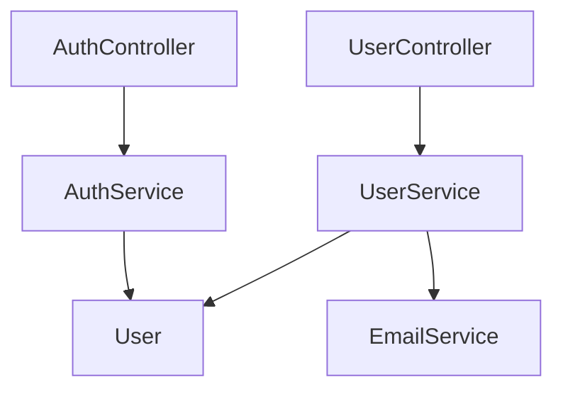

# Project Multilevel Index - User Guide

**Version**: 0.1.0
**Last Updated**: 2025-12-25

🎼 Fractal Self-Referential Documentation System - Making Code Self-Maintaining

---

## 📖 Table of Contents

1. [Quick Start](#quick-start)
2. [Installation](#installation)
3. [Core Features](#core-features)
4. [Commands](#commands)
5. [Configuration](#configuration)
6. [FAQ](#faq)
7. [Tips & Tricks](#tips--tricks)

---

## 🚀 Quick Start

### Get Started in 3 Minutes

1. **Install Extension**
   ```bash
   code --install-extension project-multilevel-index-0.1.0.vsix
   ```

2. **Open Project**
   - Open your code project in VSCode
   - Any folder with code files works

3. **Initialize Index**
   - Press `Ctrl+Shift+P` (Mac: `Cmd+Shift+P`)
   - Type: `Project Index: Initialize`
   - Select: `Project Index: Initialize Index System`
   - Wait for completion (a few seconds)

4. **Check Results**
   - Project root: `PROJECT_INDEX.md`
   - Each folder: `FOLDER_INDEX.md`
   - Each code file: Auto-generated header comment

5. **Auto-Update**
   - Edit any code file
   - Save file (`Ctrl+S`)
   - Index updates automatically! ✨

---

## 💾 Installation

### Method 1: Install from .vsix File (Current)

```bash
# Using command line
code --install-extension project-multilevel-index-0.1.0.vsix

# Or in VSCode:
# 1. Open Extensions panel (Ctrl+Shift+X)
# 2. Click "..." menu
# 3. Select "Install from VSIX..."
# 4. Choose project-multilevel-index-0.1.0.vsix
```

### Method 2: Install from Marketplace (Coming Soon)

```bash
# Search and install
ext install Claudate.project-multilevel-index
```

### Method 3: Install in Cursor

```bash
# Cursor is fully compatible with VSCode extensions
cursor --install-extension project-multilevel-index-0.1.0.vsix
```

### Verify Installation

After installation, restart VSCode, then:
1. Open Extensions panel (Ctrl+Shift+X)
2. Search "Project Multilevel Index"
3. You should see the installed extension

---

## ⭐ Core Features

### 1. Auto-Generate File Header Comments

**Example Output**:

**TypeScript/JavaScript**:
```typescript
/**
 * Input: express, ./models/User, ./services/AuthService
 * Output: UserController, createUser, getUserById, updateUser
 * Pos: API Layer - User controller, handles HTTP requests
 *
 * 🔄 Self-reference: When this file changes, update this header
 */

import express from 'express';
import { User } from './models/User';
// ... your code
```

**Python**:
```python
"""
Input: os, sys, typing, .models.user
Output: UserService, create_user, get_user_by_id
Pos: Service Layer - User business logic

🔄 Self-reference: When this file changes, update this header
"""

import os
import sys
# ... your code
```

**Supported Languages**:
- TypeScript / JavaScript
- Python
- Java / Kotlin
- Rust
- Go
- C / C++
- PHP
- Ruby
- Swift
- C#

### 2. Auto-Generate Folder Index

**FOLDER_INDEX.md Example**:
```markdown
## 📁 services/

**Architecture**:
- Business logic layer
- Calls data layer and external APIs
- Called by controller layer

**Files**:
- `user.service.ts` - User service: create, query, update users
- `auth.service.ts` - Auth service: login, register, JWT generation
- `email.service.ts` - Email service: send verification emails

🔄 Self-reference: When this folder changes, update this index
```

### 3. Auto-Generate Project Index

**PROJECT_INDEX.md Example**:
```markdown
# MyProject - Project Index

**Generated**: 2025-12-25

## 📊 Statistics

- Total files: 45
- Total folders: 8
- Languages: TypeScript, Python, JavaScript

## 📁 Directory Structure

```
src/
├── controllers/ (3 files)
├── services/ (3 files)
├── models/ (2 files)
└── utils/ (5 files)
```

## 🔗 Dependency Graph



🔄 Self-reference: Auto-updates when project structure changes
```

### 4. Real-time Auto-Update

- ✅ Monitors all code file changes
- ✅ Auto-updates file headers on save
- ✅ Auto-updates FOLDER_INDEX.md
- ✅ Debounced (avoids frequent updates)
- ✅ Runs in background, doesn't interrupt work

---

## 🎮 Commands

### Command 1: Initialize Index System

**Purpose**: Initialize the entire project's index system

**Use Cases**:
- First time using the extension
- After major project restructuring
- When index files are lost

**How to Use**:
```
Ctrl+Shift+P → Type "init" → Select "Project Index: Initialize Index System"
```

**Effects**:
- ✅ Scans all code files
- ✅ Adds header comments to each file
- ✅ Creates FOLDER_INDEX.md for each folder
- ✅ Creates PROJECT_INDEX.md in project root
- ✅ Generates dependency graph

**Expected Time**:
- Small project (10-50 files): 1-3 seconds
- Medium project (50-200 files): 3-10 seconds
- Large project (200+ files): 10-30 seconds

---

### Command 2: Update All Indexes

**Purpose**: Manually update all index files (not file headers)

**Use Cases**:
- Auto-update is disabled
- Want to immediately update all indexes
- Index content is inaccurate

**How to Use**:
```
Ctrl+Shift+P → Type "update" → Select "Project Index: Update All Indexes"
```

**Effects**:
- ✅ Updates all FOLDER_INDEX.md
- ✅ Updates PROJECT_INDEX.md
- ✅ Regenerates dependency graph

---

### Command 3: Check Index Consistency

**Purpose**: Check the integrity and consistency of the index system

**Use Cases**:
- Suspect indexes are incomplete
- After team collaboration
- Periodic health checks

**How to Use**:
```
Ctrl+Shift+P → Type "check" → Select "Project Index: Check Index Consistency"
```

**Checks**:
- ✅ PROJECT_INDEX.md exists
- ✅ Each folder has FOLDER_INDEX.md
- ✅ Each code file has header comment

**Results**:
- All good: Shows "✅ Index system is consistent!"
- Issues found: Shows issue list with fix suggestions

---

### Command 4: Toggle Auto Update

**Purpose**: Enable/disable auto-update feature

**Use Cases**:
- Temporarily disable auto-update (during heavy editing)
- Need manual control of update timing

**How to Use**:
```
Ctrl+Shift+P → Type "toggle" → Select "Project Index: Toggle Auto Update"
```

**States**:
- Enabled: Auto-updates on file save
- Disabled: Manual command execution required

---

## ⚙️ Configuration

### Open Settings

**Method 1**: Command Palette
```
Ctrl+Shift+P → Type "settings" → Select "Preferences: Open Settings (UI)"
→ Search "Project Multilevel Index"
```

**Method 2**: settings.json
```
Ctrl+Shift+P → Type "settings" → Select "Preferences: Open Settings (JSON)"
```

### Configuration Options

#### 1. Auto Update Toggle
```json
{
  "projectMultilevelIndex.autoUpdate": true
}
```
- `true`: Auto-updates on file save (recommended)
- `false`: Requires manual command execution

#### 2. Exclude Patterns
```json
{
  "projectMultilevelIndex.exclude.patterns": [
    "**/node_modules/**",
    "**/.git/**",
    "**/dist/**",
    "**/build/**",
    "**/.next/**",
    "**/target/**"
  ]
}
```
**Description**: Which folders to ignore

**Suggestion**: Add your project-specific build directories

#### 3. Use .gitignore
```json
{
  "projectMultilevelIndex.exclude.useGitignore": true
}
```
- `true`: Auto-read .gitignore rules (recommended)
- `false`: Only use exclude.patterns

#### 4. Scan Depth
```json
{
  "projectMultilevelIndex.index.maxDepth": 5
}
```
**Description**: Maximum folder depth to scan

**Suggestion**:
- Normal projects: 5 levels is enough
- Deeply nested projects: Increase to 8-10

#### 5. Dependency Graph Node Limit
```json
{
  "projectMultilevelIndex.visualization.maxNodes": 50
}
```
**Description**: Maximum nodes in dependency graph

**Suggestion**:
- Small projects: 30-50
- Large projects: 20-30 (avoid complexity)

#### 6. Notification Settings
```json
{
  "projectMultilevelIndex.notifications.enabled": true,
  "projectMultilevelIndex.notifications.showOnMinorChange": false
}
```
- `enabled`: Show update notifications
- `showOnMinorChange`: Show minor update notifications

---

## ❓ FAQ

### Q1: Extension activation failed?

**Symptom**: No extension-related prompts after opening VSCode

**Solution**:
1. Check if extension is enabled: Extensions → Search "Project Multilevel Index" → Ensure enabled
2. Restart VSCode: `Ctrl+Shift+P` → "Reload Window"
3. Check output logs: View → Output → Select "ProjectIndex"

---

### Q2: Can't find commands?

**Symptom**: Can't find commands in Command Palette

**Solution**:
1. Confirm a workspace (folder) is opened
2. Check extension is correctly installed
3. Try restarting VSCode

---

### Q3: Auto-update not working?

**Symptom**: Index doesn't update after saving file

**Solution**:
1. Check if auto-update is enabled:
   - Settings → Search "projectMultilevelIndex.autoUpdate"
   - Ensure set to `true`
2. Check if file is in exclude list
3. Check Output logs for errors

---

### Q4: File header comment format incorrect?

**Symptom**: Generated comment is not in expected format

**Solution**:
1. Check file extension is correct
2. Confirm language is in supported list
3. Manually run "Initialize Index System" to regenerate

---

### Q5: Performance issues with large projects?

**Symptom**: Slow or laggy during initialization or updates

**Optimization**:
1. Add more exclude patterns (exclude more directories)
2. Reduce dependency graph node limit
3. Temporarily disable auto-update
4. Process large projects in batches

---

### Q6: Index conflicts during team collaboration?

**Symptom**: Inconsistent indexes after multiple people modify code

**Solution**:
1. Include index files in version control (recommended)
2. Or add index files to .gitignore
3. Each person runs "Initialize Index System" locally

---

## 💡 Tips & Tricks

### Tip 1: Project Documentation Automation

```bash
# 1. Initialize index
Run: Initialize Index System

# 2. Add index files to Git
git add PROJECT_INDEX.md
git add **/FOLDER_INDEX.md
git commit -m "docs: add auto-generated indexes"

# 3. Team members get complete documentation after cloning
```

### Tip 2: Code Review Assistant

```bash
# View change impact:
1. git diff PROJECT_INDEX.md
   # See if dependency graph changed

2. git diff src/services/FOLDER_INDEX.md
   # See service layer changes

3. git diff src/services/user.service.ts
   # See specific code changes
```

### Tip 3: New Developer Onboarding

```markdown
# Project introduction process:
1. First read PROJECT_INDEX.md (global view)
2. Then read each folder's FOLDER_INDEX.md (module view)
3. Finally read file header comments (detail view)

# Understand project structure in 3 minutes!
```

### Tip 4: Refactoring Tracking

```bash
# Before refactoring:
git tag refactor-start

# Perform refactoring...

# After refactoring:
git diff refactor-start PROJECT_INDEX.md
# Clearly see architecture changes
```

### Tip 5: Custom Keyboard Shortcuts

```json
// keybindings.json
{
  "key": "ctrl+shift+i",
  "command": "project-multilevel-index.init"
},
{
  "key": "ctrl+shift+u",
  "command": "project-multilevel-index.update"
}
```

---

## 🎯 Best Practices

### 1. Project Initialization

```bash
# When starting a new project:
1. git init
2. Create .gitignore
3. Run "Initialize Index System"
4. git add .
5. git commit -m "chore: initialize project with index system"
```

### 2. Continuous Maintenance

```bash
# Keep auto-update enabled
# Run "Check Index Consistency" periodically (weekly)
# Run "Update All Indexes" after major refactoring
```

### 3. Team Collaboration

```bash
# Recommendations:
- ✅ Include index files in version control
- ✅ Run consistency checks in CI
- ✅ Include index changes in PRs
- ✅ Review dependency changes during code review
```

---

## 📊 Before & After Comparison

### Before ❌
```
- New developers: Don't know where to start
- File dependencies: Slowly jump through IDE
- Project architecture: Need separate documentation
- Doc maintenance: Easily outdated, manual updates tedious
```

### After ✅
```
- New developers: Understand structure in 3 minutes
- File dependencies: See all relationships in one graph
- Project architecture: Auto-generated, always current
- Doc maintenance: Fully automated, zero burden
```

---

## 🆘 Get Help

### View Logs
```
View → Output → Select "ProjectIndex"
```

### Report Issues
- GitHub Issues: https://github.com/Claudate/project-multilevel-index/issues
- Include: Error messages, VSCode version, project size

### Join Discussion
- GitHub Discussions: https://github.com/Claudate/project-multilevel-index/discussions

---

## 🎓 Advanced Resources

- [Complete Testing Guide](TESTING.md)
- [Development Status](DEVELOPMENT_STATUS.md)
- [Implementation Summary](IMPLEMENTATION_SUMMARY.md)
- [Publishing Guide](PUBLISHING_GUIDE.md)

---

## 📝 Changelog

### v0.1.0 (2025-12-25)

**Initial Release**:
- ✅ 4 core commands
- ✅ 10+ programming languages support
- ✅ Auto-update functionality
- ✅ Configuration options
- ✅ Complete documentation

---

**🎼 Making your code like a fugue - self-referential, self-maintaining, elegant, and harmonious!**

---

**Made with ❤️ by Claudate**

[⬆️ Back to Top](#project-multilevel-index---user-guide)
