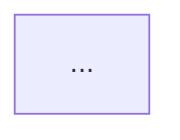

# 手动测试指南

## 🎯 目标
验证VSCode扩展的所有核心功能

## 📋 准备工作

### 1. 打开扩展开发环境
```bash
# 在vscode-extension文件夹中打开VSCode
cd h:\Project\Claud_skill\project-multilevel-index\vscode-extension
code .
```

### 2. 确保已构建
```bash
npm run build
# 或使用watch模式（自动重新构建）
npm run watch
```

### 3. 启动Extension Development Host
- 在VSCode中按 `F5` 键
- 或点击 "Run and Debug" → 点击绿色播放按钮
- 等待新窗口打开（标题包含 `[Extension Development Host]`）

---

## ✅ 测试步骤

### 测试 1: 扩展激活

**步骤**:
1. 在Extension Development Host窗口中，打开测试项目
   - File → Open Folder
   - 选择: `h:\Project\Claud_skill\project-multilevel-index\examples\cursor-example`

2. 查看Output面板
   - View → Output
   - 从下拉菜单选择 "ProjectIndex"

**预期结果**:
- ✅ 看到激活日志: "Activating Project Multilevel Index extension..."
- ✅ 看到: "Workspace root: ..."
- ✅ 看到: "File watcher started"
- ✅ 看到: "✅ Project Multilevel Index extension activated successfully"
- ✅ 可能会弹出欢迎消息（首次激活）

**实际结果**: ___________

---

### 测试 2: Initialize Index System 命令

**步骤**:
1. 打开命令面板: `Ctrl+Shift+P` (Windows/Linux) 或 `Cmd+Shift+P` (Mac)
2. 输入: "Project Index: Initialize"
3. 选择: "Project Index: Initialize Index System"
4. 等待完成

**预期结果**:
- ✅ 显示进度通知: "Initializing Project Index"
- ✅ Output日志显示:
  - "Found X code files"
  - "Updated X file headers"
  - "Found X folders with code"
  - "Updated X folder indexes"
  - "Updated project index"
  - "✅ Index system initialized successfully"
- ✅ 显示成功消息: "✅ Project index initialized successfully!"
- ✅ 在项目根目录创建 `PROJECT_INDEX.md`
- ✅ 在每个文件夹创建 `FOLDER_INDEX.md`
- ✅ 每个代码文件顶部添加了头注释

**实际结果**: ___________

**验证文件**:
```bash
# 检查是否创建了索引文件
dir PROJECT_INDEX.md
dir src\FOLDER_INDEX.md
dir src\controllers\FOLDER_INDEX.md
dir src\services\FOLDER_INDEX.md
dir src\models\FOLDER_INDEX.md
dir src\utils\FOLDER_INDEX.md
```

---

### 测试 3: 检查生成的文件头

**步骤**:
1. 打开 `examples\cursor-example\src\services\user.service.ts`
2. 查看文件顶部的注释

**预期结果**:
```typescript
/**
 * Input: ../models/User
 * Output: UserService, createUser, getUserById, ...
 * Pos: Service层 - 用户业务逻辑
 *
 * 🔄 Self-reference: When this file changes, update this header
 */
```

**实际结果**: ___________

---

### 测试 4: 检查FOLDER_INDEX.md

**步骤**:
1. 打开 `examples\cursor-example\src\services\FOLDER_INDEX.md`

**预期结果**:
```markdown
## 📁 services/

**Architecture**:
...

**Files**:
- `user.service.ts` - ...
- `auth.service.ts` - ...

🔄 Update when folder changes
```

**实际结果**: ___________

---

### 测试 5: 检查PROJECT_INDEX.md

**步骤**:
1. 打开 `examples\cursor-example\PROJECT_INDEX.md`

**预期结果**:
```markdown
# Project Index

## Directory Structure
...

## Dependency Graph

```

**实际结果**: ___________

---

### 测试 6: Update All Indexes 命令

**步骤**:
1. 修改一个文件（例如添加一个函数到 `user.service.ts`）
2. 保存文件
3. 打开命令面板: `Ctrl+Shift+P`
4. 运行: "Project Index: Update All Indexes"

**预期结果**:
- ✅ 显示进度通知
- ✅ Output日志显示: "✅ All indexes updated successfully"
- ✅ 显示成功消息
- ✅ FOLDER_INDEX.md 和 PROJECT_INDEX.md 被更新

**实际结果**: ___________

---

### 测试 7: Check Index Consistency 命令

**步骤**:
1. 打开命令面板: `Ctrl+Shift+P`
2. 运行: "Project Index: Check Index Consistency"

**预期结果（如果索引完整）**:
- ✅ 显示: "✅ Index system is consistent!"

**预期结果（如果有问题）**:
- ✅ 显示警告消息，列出问题
- ✅ 提供 "Fix Issues" 按钮

**实际结果**: ___________

---

### 测试 8: 自动更新功能

**步骤**:
1. 确保自动更新已启用（默认启用）
2. 打开 `src/services/user.service.ts`
3. 添加一个新的导入或函数:
   ```typescript
   import { Logger } from '../utils/logger';

   export function newFunction() {
     return 'test';
   }
   ```
4. 保存文件 (`Ctrl+S`)
5. 查看Output面板

**预期结果**:
- ✅ Output日志显示: "Updating indexes for: ..."
- ✅ 显示通知: "📄 Index updated: user.service.ts"
- ✅ 文件头注释自动更新（包含新的导入）
- ✅ FOLDER_INDEX.md 自动更新
- ✅ 延迟300ms后才更新（防抖）

**实际结果**: ___________

---

### 测试 9: Toggle Auto Update 命令

**步骤**:
1. 打开命令面板: `Ctrl+Shift+P`
2. 运行: "Project Index: Toggle Auto Update"
3. 查看消息

**预期结果**:
- ✅ 显示: "Auto-update disabled" 或 "Auto-update enabled"
- ✅ 再次运行命令，状态应该切换

**实际结果**: ___________

---

### 测试 10: 多语言支持

**步骤**:
1. 在示例项目中创建不同语言的测试文件:
   ```bash
   # Python
   echo "def hello(): pass" > test.py

   # Java
   echo "public class Test {}" > Test.java

   # Rust
   echo "fn main() {}" > main.rs
   ```
2. 运行 "Initialize Index System"
3. 检查这些文件是否都有头注释

**预期结果**:
- ✅ Python文件有 `"""..."""` 注释
- ✅ Java文件有 `/**...*/` 注释
- ✅ Rust文件有 `//!...` 注释

**实际结果**: ___________

---

### 测试 11: 排除文件夹

**步骤**:
1. 在项目中创建 `node_modules` 文件夹
2. 添加一些测试文件
3. 运行 "Initialize Index System"

**预期结果**:
- ✅ `node_modules` 中的文件被忽略
- ✅ Output日志中不包含 `node_modules` 文件

**实际结果**: ___________

---

### 测试 12: 错误处理

**步骤**:
1. 创建一个包含语法错误的TypeScript文件
2. 保存文件，触发自动更新

**预期结果**:
- ✅ 扩展不崩溃
- ✅ Output日志显示警告（但继续运行）
- ✅ 其他文件仍然被正确处理

**实际结果**: ___________

---

### 测试 13: 大型项目性能

**步骤**:
1. 在一个有50+文件的项目中运行初始化
2. 记录时间

**预期结果**:
- ✅ 50个文件: <5秒
- ✅ 100个文件: <10秒
- ✅ 显示进度通知

**实际结果**: ___________

---

## 🐛 Bug 记录

### Bug 1: [标题]
- **描述**:
- **重现步骤**:
- **预期行为**:
- **实际行为**:
- **严重程度**: Critical / High / Medium / Low

### Bug 2: [标题]
...

---

## 📊 测试总结

**测试日期**: 2025-12-25
**测试人员**: ___________
**VSCode版本**: ___________
**操作系统**: ___________

### 通过率
- 通过: ___ / 13
- 失败: ___ / 13
- 跳过: ___ / 13

### 总体评价
- [ ] ✅ 可以发布
- [ ] ⚠️ 需要修复bug后发布
- [ ] ❌ 需要重大修改

### 备注
___________

---

## 🔍 调试技巧

### 查看详细日志
1. 打开Output面板: View → Output
2. 选择 "ProjectIndex"
3. 所有日志都会在这里显示

### 使用断点调试
1. 在源代码中设置断点（点击行号左侧）
2. 按F5启动调试
3. 触发相应命令
4. 在断点处暂停，可以查看变量值

### 重新加载扩展
- 在Extension Development Host窗口中:
  - `Ctrl+R` (Windows/Linux) 或 `Cmd+R` (Mac)
  - 或运行命令: "Developer: Reload Window"

### 查看VSCode开发者工具
- Help → Toggle Developer Tools
- 可以查看Console中的错误

---

**祝测试顺利！** 🎉
